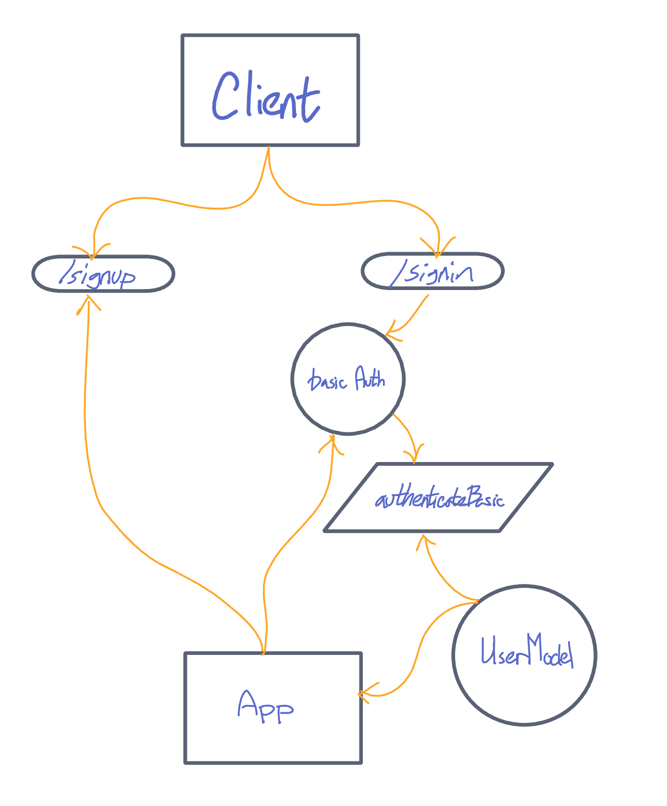

# Basic Authentication Server

Deployed Site: https://basic-authentication-server.herokuapp.com/ 

Latest Pull Request: https://github.com/Micha-L-Davis/basic-auth/pull/2

## Installation

1. Clone this repository onto your local machine
2. `cd` into `./basic-auth`
3. Install package dependencies with `npm install`

## Author

Micha Davis

## Routes

* POST : `/signin`
    * Parameters: 
        * username 
        * password
    * Response
        * 201 if valid.   

* POST : `/signup`
    * Parameters: 
        * username 
        * password
    * Response
        * 500 if invalid
        * 201 if valid.   
